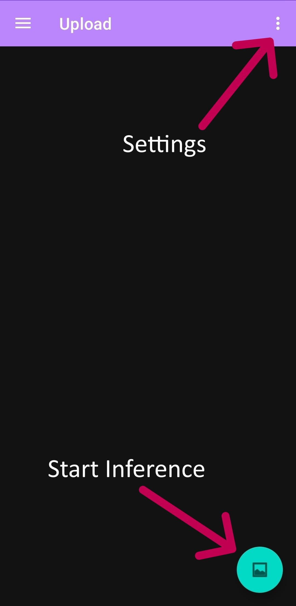
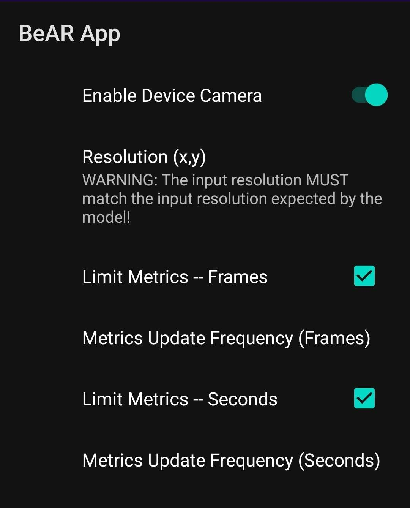

# BeAR: Benchmarking in Augmented Reality 
Android application for AR benchmarking using MTL models. Developed by Austin Funk as part of his Honors thesis in computer engineering at Brown University.
## 🔍 Introduction
BeAR provides various benchmarking metrics for Multi-Task Learning (MTL) models. The purpose of this app is to provide flexible testing and benchmarking on edge devices without requiring extensive dependencies, such as Google's ARCore. Specific runtime improvements have been implemented as well, notably support for pipelined execution of the encoder and decoder(s).
## 📢 In Development
- [ ] More robust user control over split model naming and other specifications
- [ ] Easy in-app uploading of models
- [ ] Provide sample code for creating split models, converting text metrics outputs to LaTEX tables, etc.
- [ ] Eliminate UI hang due to MTLBox recreation, or add loading screen
- [ ] In-app splitting of MTL models
- [ ] Create requirements.txt
- [ ] Support devices without NPUs by searching for alternative processors
- [ ] Circumvent Android's automatic closing of the devices camera after X amount of time
## 📏 Installation
- Option 1: Download Android Studio and build from this repository. Be sure to install the `assets` folder following the instructions below.
- Option 2: (NOT YET SUPPORTED) Download the APK provided.
## 🔧 Hardware Requirements
This app only works for Android devices with SDK>=26, though SDK=34+ is recommended. Some key functions, specifically photo picking and camera operation, require permission that can be activated once in-app via a pop up. It is also recommended for your device to have an NPU (preferable) or GPU.
## 📁 Assets
BeAR currently requires a dedicated folder for models **before compile time.** This folder must be organized like so:
- `assets`
  - `decoders`
  - `encoders`
  - `full`

The `assets` folder must be in the following location to be recognized by the Android compiler:
- `BeAR_APP` (Top level directory)
  - `app`
    - `src`
      - `main`
        - `assets` <--

The version of the `assets` folder used in Austin's thesis can be found on Google Drive here: https://drive.google.com/drive/folders/1dQYM72Gw093bTJqF8llspFFHK6Uat6bh?usp=sharing
## 💻 Usage
Before attempting to run the model, it is highly recommended that you peruse the settings and verify that everything is set up as you want it. Once all settings are to your liking, simply press the image icon in the bottom right corner of your screen. 

   

To view the model input and output(s) along with recorded metrics, simply swipe to navigate different views. Responsiveness is dependent on model performance and postprocessing speeds. To pause and unpause the camera, simply press the start button again. This is necessary to prevent app crashes due to limitations to Android app camera permissions. 
The settings menu can be accessed via the three dots in the top right hand corner of the home page. The navigation accessible via the top left corner should not be used at this time, and users should remain on the "Upload" page regardless of if they are uploading their input image or using the device's camera. Within the settings, there are currently three menus: Metrics, Camera, and Model. 

   

### Metrics
The various metrics should be understandable purely from their name and units. Some metrics, including (but not limited to) memory usage, battery usage, power consumption, and temperature change, should only be considered over large sample sizes, where large is considered minimally 10 seconds. 

   

### Camera
The camera menu allows you to enable/disable the device's camera as well as other key settings, and therefore **should not be skipped regardless of whether you plan to use the camera or not.** 
Resolution refers to the *input resolution required by the model*. The default resolution of (224, 224) is common for most models. 
The metric limiters determine when metrics should be recorded, allowing for more accurate benchmarking in the areas described previously. 

   

### Model
Most settings here should be straightforward. **It is essential that all outputs are mapped to a postprocessing method, as the default method does not currently work for ONNX models.** These outputs, as far as I'm aware, are case sensitive and should match **exactly** with the output dictionary produced by the model in, say, a Python environment. **Split Execution** and **Pipelined Execution** are experimental, and require the encoder and decoder(s) to be selected manually. Adding custom encoders and decoders currently requires changing the source code to match any in-between processing that has to happen before sending the encoder output to each decoder. 

   

### Add a postprocessing method
This requires changing the source code, though most changes are simply adding names to existing lists/enums.
Video

## 🔨 Known Issues
- Some models don't work, and selecting them could break the app and require a difficult process of removing the file, clearing the cache using `clearFiles(Context context)` - commented out in `MTLBox.java`, and rebuilding from the source code. The only known broken model right now is `swin_tiny_nyud-int8-fused.onnx`, which has been removed from the codebase.
- Some settings, specifically when selecting split pieces of models, sometimes don't save when they're expected to. This is because the interface is not built by Android, so it's more prone to bugs.

## 🤖 Developer Information
If you're looking to make changes to this app, your best resources will be the nested READMEs in this project. Specifically, you should look in the following folders:
- Path 1
- Path 2

## 🙌 Acknowledgements
Thank you to my advisor [Professor Sherief Reda](https://scale-lab.github.io/) for his guidance and expertise. Thank you to [Mahdi Boulila](https://github.com/MahdiBoulila) for his tireless mentorship and support. Thank you to [Harb Lin](https://engineering.brown.edu/people/shangran-lin) for his contributions to model-level acceleration.
## ✍️ Authorship
Current authors of the project:
- [Austin Funk](https://austin-funk.github.io/)

## 📖 Citation
There is currently no publication related to this work. Feel free to read and reference my thesis, available at https://scale-lab.github.io/.

## License
MIT License. See [LICENSE](LICENSE) file
