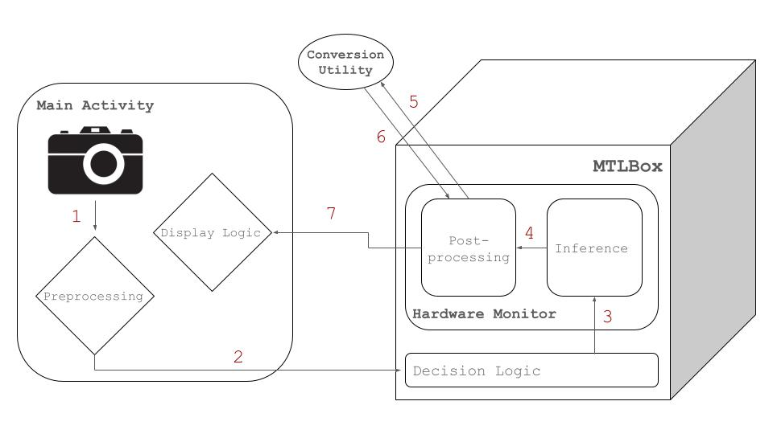

# Developer Guide
This README (and all other nested READMEs) are intended for developers that wish to expand on this project.
## General Pipeline
Below is a diagram for data movement through the application. When the app receives an image (either through the camera or 
image selector), it goes through minimal preprocessing in `MainActivity` and `MTLBox`. `MTLBox` then sends the data to the proper 
`HardwareMonitor`, which both processes the image and collects metrics information. The data is sent to the `ConversionUtil` before 
being sent back to `MTLBox` and returned to `MainActivity` for the resultant image to be displayed. This process changes when pipelining, 
primarily in the callback system and in-between processing. Currently, the in-between processing is hard coded for a specific encoder
output. More specific information can be found in the READMEs in `datatypes`, `monitor`, `ui`, and `util`.

   

## Settings
Adding and removing settings is simple, but requires editing multiple files. Most of the `xml` can be found in `res`, specifically in `xml/layout` and `xml/xml`. 
`SettingsActivity` contains all of the logic for the different settings pages, and the specific settings are in the corresponding `xml` file. For example, 
if a setting is in the `Model` subpage, then the `xml` for it is in `xml/xml/model_preferences.xml`. The fragments in `ui/settings` are also important but likely 
won't ever need to be edited.
